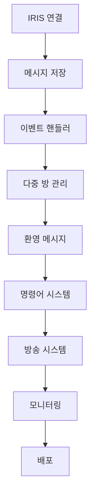

# 단계별 구현 Task 목록
## 카카오톡 오픈채팅 자동화 솔루션

---

## 📋 Phase 1: 기반 인프라 구축 (2주)
**기간**: 2025-10-27 ~ 2025-11-10
**목표**: IRIS 연결 및 기본적인 메시지 처리 기능 구현

### Week 1: 기초 환경 설정

#### ✅ 완료된 작업
- [x] 프로젝트 구조 설계
- [x] IRIS 설치 방법 확인 및 연결 테스트
- [x] 환경변수 설정 및 자격증명 관리
- [x] Playwright 기반 자동 접속 시스템

#### 🔄 진행 중인 작업

**Task 1.1: IRIS 연결 모듈 강화**
- [ ] IRIS WebSocket 연결 안정화
- [ ] 연결 상태 모니터링 기능 추가
- [ ] 자동 재연결 로직 구현 (지수 백오프)
- [ ] 연결 테스트 자동화 스크립트 작성

**Task 1.2: 메시지 저장 기본 기능**
- [ ] `src/services/message_store.py` 기능 확장
- [ ] SQLite 데이터베이스 스키마 설계
- [ ] 메시지 CRUD 작업 구현
- [ ] 데이터 백업 및 복구 기능

**Task 1.3: 로깅 시스템 구축**
- [ ] 구조화된 로그 포맷 설계
- [ ] 로그 레벨별 파일 분리
- [ ] 로그 자동 회전 (log rotation)
- [ ] 성능 모니터링 로그 추가

**Task 1.4: 기본 명령어 처리기**
- [ ] 명령어 파싱 로직 구현
- [ ] `!help`, `!status` 기본 명령어 구현
- [ ] 명령어 권한 체크 기능
- [ ] 명령어 실행 결과 포맷팅

#### 📝 Week 2: 이벤트 처리 기반

**Task 1.5: 이벤트 핸들러 아키텍처**
- [ ] 이벤트 기반 아키텍처 설계
- [ ] `src/bot/event_handlers/` 디렉토리 구조화
- [ ] 이벤트 라우팅 시스템 구현
- [ ] 비동기 이벤트 처리 구조

**Task 1.6: 메시지 이벤트 핸들러**
- [ ] 메시지 파싱 및 분류 기능
- [ ] 멘션, 첨부파일 처리
- [ ] 스팸 필터링 기능
- [ ] 메시지 통계 수집

**Task 1.7: 입장/퇴장 이벤트 핸들러**
- [ ] `join`, `leave` 이벤트 처리
- [ ] 사용자 프로필 정보 추출
- [ ] 참여자 목록 관리
- [ ] 입장/퇴장 히스토리 로그

**Task 1.8: 기본 테스트 코드**
- [ ] 단위 테스트 프레임워크 설정 (pytest)
- [ ] IRIS 연결 모듈 테스트
- [ ] 메시지 저장 기능 테스트
- [ ] 기본 명령어 테스트 케이스

---

## 🚀 Phase 2: 핵심 기능 구현 (4주)
**기간**: 2025-11-11 ~ 2025-12-09
**목표**: 다중 방 관리, 환영 메시지, 고급 명령어 구현

### Week 3: 다중 방 관리 시스템

**Task 2.1: 방 관리 기능**
- [ ] 방 등록/해제 기능 구현
- [ ] 방별 설정 관리 (`config/rooms.json`)
- [ ] 방 상태 모니터링
- [ ] 최대 50개 방 동시 지원

**Task 2.2: 방별 메시지 처리**
- [ ] 방별 이벤트 라우팅
- [ ] 메시지 중복 제거
- [ ] 방별 통계 수집
- [ ] 활동량 기반 방 우선순위

**Task 2.3: 데이터베이스 스키마 확장**
- [ ] 방 정보 테이블 설계
- [ ] 사용자 정보 테이블 설계
- [ ] 메시지 메타데이터 확장
- [ ] 인덱스 최적화

**Task 2.4: 방 검색 및 필터링**
- [ ] 방 목록 조회 기능
- [ ] 검색 기능 (이름, ID, 활동량)
- [ ] 방별 상태 필터링
- [ ] 실시간 방 목록 갱신

### Week 4: 환영 메시지 자동화

**Task 2.5: 환영 메시지 템플릿 시스템**
- [ ] `config/templates/welcome/` 템플릿 구조
- [ ] 동적 템플릿 엔진 구현
- [ ] 개인화된 메시지 생성
- [ ] 멀티미디어 콘텐츠 지원

**Task 2.6: 환영 핸들러 구현**
- [ ] `src/services/welcome_handler.py` 완전 구현
- [ ] 입장 이벤트 감지 및 처리
- [ ] 중복 환영 방지 로직
- [ ] 실패 시 재시도 기능

**Task 2.7: 이미지 전송 기능**
- [ ] IRIS 이미지 전송 API 연동
- [ ] 이미지 최적화 및 리사이징
- [ ] 전송 상태 추적
- [ ] 대체 텍스트 전송 로직

**Task 2.8: 환영 성능 최적화**
- [ ] 환영 메시지 전송 속도 최적화
- [ ] 동시 다수 입장 처리
- [ ] 메시지 큐 관리
- [ ] 지연 시간 모니터링

### Week 5: 고급 명령어 시스템

**Task 2.9: 명령어 확장**
- [ ] 관리자용 명령어 구현 (`!stats`, `!announce`)
- [ ] 사용자용 명령어 구현 (`!help`, `!rules`)
- [ ] API 호출 명령어 (`!weather`, `!search`)
- [ ] 동적 명령어 등록 기능

**Task 2.10: 권한 관리 시스템**
- [ ] 역할 기반 접근 제어 (RBAC)
- [ ] 사용자 권한 데이터베이스 관리
- [ ] 명령어별 권한 체크
- [ ] 임시 권한 부여 기능

**Task 2.11: 명령어 플러그인 아키텍처**
- [ ] 플러그인 시스템 설계
- [ ] 동적 플러그인 로딩
- [ ] 플러그인 설정 관리
- [ ] 샘플 플러그인 제공

**Task 2.12: 명령어 성능 모니터링**
- [ ] 명령어 실행 시간 측정
- [ ] 사용 빈도 통계
- [ ] 에러율 모니터링
- [ ] 성능 보고서 생성

### Week 6: 에러 처리 및 안정화

**Task 2.13: 에러 핸들링 강화**
- [ ] 전역 예외 처리 시스템
- [ ] 에러 로깅 및 분류
- [ ] 자동 복구 로직
- [ ] 에러 알림 시스템

**Task 2.14: 재시도 및 회복机制**
- [ ] 재시도 정책 설계 (지수 백오프)
- [ ] 장애 조치 자동화
- [ ] 데이터 일관성 보장
- [ ] 부분 장애 대응

**Task 2.15: 상태 관리**
- [ ] 애플리케이션 상태 모니터링
- [ ] 상태 복원 기능
- [ ] 상태 기반 자동 조치
- [ ] 헬스체크 엔드포인트

**Task 2.16: 통합 테스트**
- [ ] 통합 테스트 환경 구축
- [ ] end-to-end 시나리오 테스트
- [ ] 부하 테스트 (50개 방 시뮬레이션)
- [ ] 안정성 테스트 (24시간 연속 운영)

---

## 🎯 Phase 3: 고급 기능 및 안정화 (3주)
**기간**: 2025-12-10 ~ 2025-12-31
**목표**: 방송 시스템, 스케줄링, 모니터링 대시보드

### Week 7: 방송 메시지 시스템

**Task 3.1: 방송 큐 시스템**
- [ ] `src/services/broadcast_scheduler.py` 구현
- [ ] Redis 기반 메시지 큐
- [ ] 우선순위 큐 관리
- [ ] 큐 모니터링 및 관리

**Task 3.2: 일괄 메시지 전송**
- [ ] 다중 방 동시 전송 로직
- [ ] 전송 상태 추적
- [ ] 실패한 방 재시도
- [ ] 전송 진행률 표시

**Task 3.3: 스케줄링 기능**
- [ ] 예약 전송 시스템
- [ ] Cron 표현식 지원
- [ ] 반복 전송 설정
- [ ] 스케줄 관리 API

**Task 3.4: 방송 결과 보고**
- [ ] 상세 결과 보고서 생성
- [ ] 성공/실패 통계
- [ ] Slack/Email 알림 연동
- [ ] 방송 이력 관리

### Week 8: 모니터링 및 대시보드

**Task 3.5: 메트릭 수집 시스템**
- [ ] Prometheus 메트릭 수집
- [ ] 커스텀 메트릭 정의
- [ ] 시스템 리소스 모니터링
- [ ] 애플리케이션 성능 메트릭

**Task 3.6: 대시보드 구현**
- [ ] Grafana 대시보드 설정
- [ ] 실시간 모니터링 뷰
- [ ] 통계 및 트렌드 차트
- [ ] 알림 설정 관리

**Task 3.7: 로그 분석 시스템**
- [ ] ELK 스택 연동 (선택사항)
- [ ] 로그 검색 및 필터링
- [ ] 이상 패턴 감지
- [ ] 자동 로그 리포트

**Task 3.8: 성능 최적화**
- [ ] 병목 지점 분석
- [ ] 메모리 사용량 최적화
- [ ] 데이터베이스 쿼리 최적화
- [ ] 캐싱 전략 도입

### Week 9: 고급 기능 및 통합

**Task 3.9: API 게이트웨이**
- [ ] FastAPI 기반 API 서버
- [ ] RESTful API 설계
- [ ] API 인증 및 권한
- [ ] API 문서 자동화 (Swagger)

**Task 3.10: 외부 연동**
- [ ] ChatGPT API 연동
- [ ] 날씨 정보 API 연동
- [ ] 검색 API 연동
- [ ] 커스텀 API 연동 프레임워크

**Task 3.11: 데이터 분석**
- [ ] 메시지 분석 기능
- [ ] 사용자 행동 분석
- [ ] 트렌드 분석
- [ ] 예측 분석 (선택사항)

**Task 3.12: 보안 강화**
- [ ] 보안 감사 로그
- [ ] 침입 탐지 시스템
- [ ] 데이터 암호화 강화
- [ ] 보안 스캔 자동화

---

## 🚢 Phase 4: 운영 준비 및 배포 (2주)
**기간**: 2026-01-01 ~ 2026-01-15
**목표**: 프로덕션 배포, 운영 문서, 사용자 교육

### Week 10: 배포 자동화

**Task 4.1: CI/CD 파이프라인**
- [ ] GitHub Actions 설정
- [ ] 자동 빌드 및 테스트
- [ ] 배포 자동화
- [ ] 롤백 전략

**Task 4.2: 컨테이너화**
- [ ] Dockerfile 작성
- [ ] Docker Compose 설정
- [ ] 환경별 컨테이너 관리
- [ ] 컨테이너 오케스트레이션

**Task 4.3: 배포 스크립트**
- [ ] `scripts/deploy.sh` 작성
- [ ] 데이터베이스 마이그레이션
- [ ] 설정 관리 자동화
- [ ] 헬스체크 및 검증

**Task 4.4: 운영 환경 설정**
- [ ] 프로덕션 환경 구성
- [ ] 모니터링 알림 설정
- [ ] 백업 전략 수립
- [ ] 재해 복구 계획

### Week 11: 문서화 및 교육

**Task 4.5: 기술 문서**
- [ ] API 문서 완성
- [ ] 아키텍처 문서
- [ ] 트러블슈팅 가이드
- [ ] 성능 튜닝 가이드

**Task 4.6: 운영 문서**
- [ ] 운영자 매뉴얼
- [ ] 모니터링 가이드
- [ ] 장애 대응 매뉴얼
- [ ] 정기 점검 체크리스트

**Task 4.7: 사용자 교육**
- [ ] 사용자 매뉴얼 작성
- [ ] 동영상 튜토리얼 제작
- [ ] FAQ 작성
- [ ] 온보딩 프로세스

**Task 4.8: 프로젝트 마무리**
- [ ] 최종 코드 리뷰
- [ ] 보안 감사
- [ ] 라이선스 확인
- [ ] 프로젝트 롤아웃

---

## 📊 Task 관리 및 추적

### Task 상태 정의
- **🔄 진행 중**: 현재 작업 중인 Task
- **✅ 완료**: 완료된 Task
- **⏸️ 보류**: 일시 중단된 Task
- **❌ 실패**: 실패하거나 취소된 Task
- **📋 예정**: 예약된 Task

### 우선순위 레벨
- **P0**: Critical - 즉시 처리 필요
- **P1**: High - 이번 주 내 처리
- **P2**: Medium - 다음 주 내 처리
- **P3**: Low - 시간 여유 시 처리

### 의존성 관리

### 위험 관리
| 위험 | 확률 | 영향 | 대응책 | 담당자 |
|------|------|------|--------|--------|
| IRIS 연결 불안정 | 중간 | 높음 | 자동 재연결, 모니터링 강화 | 개발팀 |
| 성능 저하 | 낮음 | 중간 | 프로파일링, 최적화 | 개발팀 |
| 데이터 유실 | 낮음 | 높음 | 백업 전략, 중복 저장 | 운영팀 |
| 보안 이슈 | 낮음 | 높음 | 정기 보안 감사, 취약점 점검 | 보안팀 |

---

## 🎯 성공 측정 기준

### 기술적 성공 지표
- **가용성**: 99.9% 이상 유지
- **응답 시간**: 평균 2초 이내
- **처리량**: 초당 100개 메시지 처리
- **에러률**: 0.1% 미만 유지

### 기능적 성공 지표
- **방 관리**: 50개 방 동시 운영
- **환영 메시지**: 99% 성공률
- **방송 성공률**: 99% 이상
- **명령어 응답**: 95% 이상 성공

### 운영적 성공 지표
- **다운타임**: 월간 43분 이내
- **복구 시간**: 장애 발생 후 5분 이내 복구
- **문서 완성도**: 모든 기능에 대한 문서화
- **사용자 만족도**: 90% 이상

---

*Task 목록 버전: v1.0*
*작성일: 2025-10-27*
*마지막 업데이트: 2025-10-27*
*다음 리뷰: 매주 금요일*